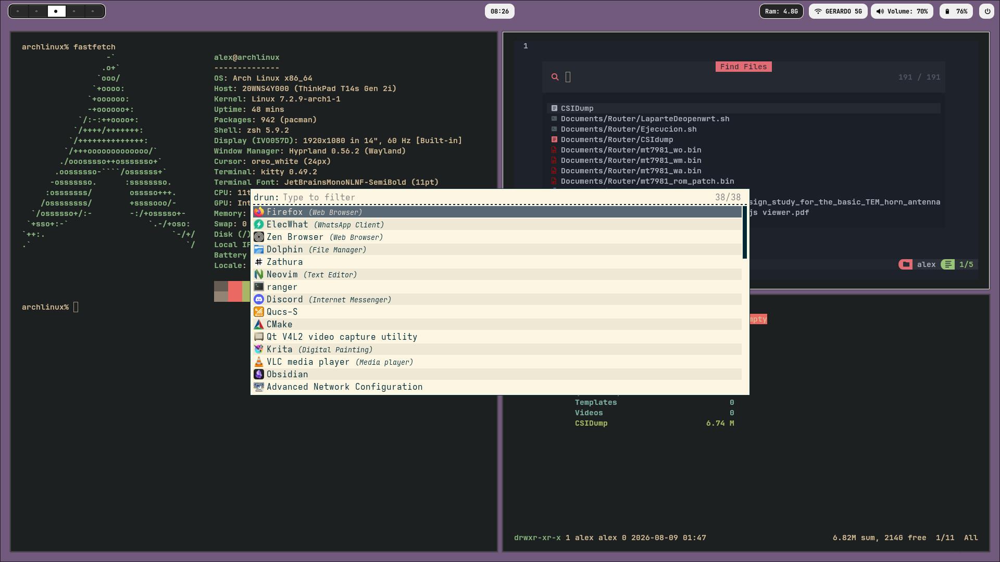
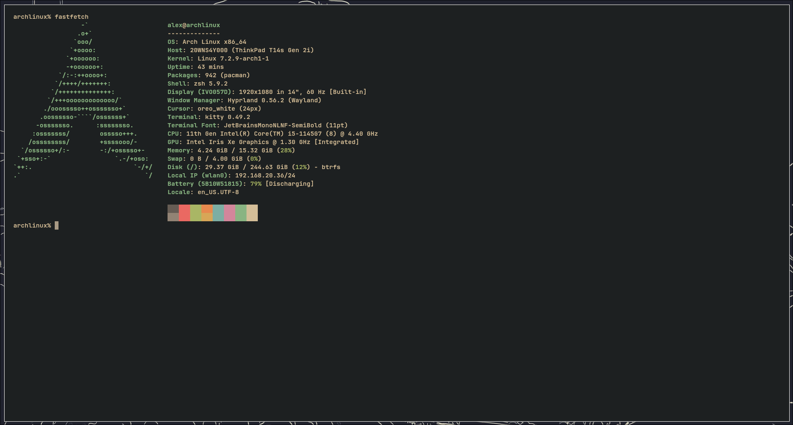
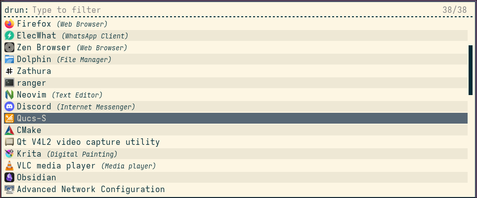
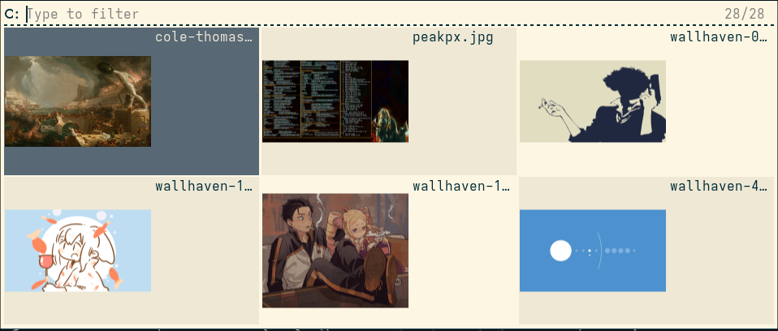
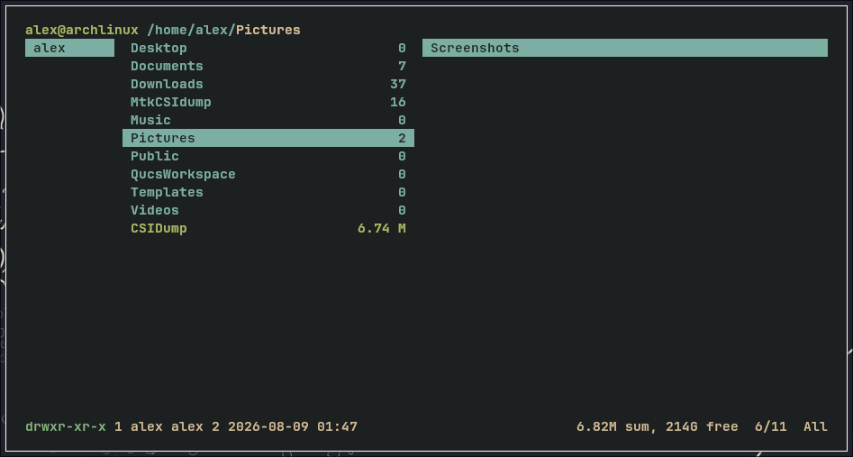

# Mi-Dotfiles
Este es mi dotfiles para un escritorio de hyprland relativamente simple y que contiene el uso de rofi y de waybar. 

# Hyprland Dotfiles | Arch Linux

Bienvenido a mi configuración personal de **Arch Linux** con el gestor de ventanas **Hyprland**. Este repositorio contiene todo lo necesario para replicar mi entorno de trabajo, desde el gestor de ventanas hasta la configuración de la terminal y scripts personalizados.

---

## Capturas de Pantalla


*Desktop con Hyprland, Waybar y Rofi*

| Terminal (Kitty) | Rofi Selector | Fastfetch |
| :---: | :---: | :---: | :---: |
|  |  |  |  | 

---

## Especificaciones del Sistema

* **SO:** Arch Linux 🐧
* **WM:** Hyprland (Wayland)
* **Shell:** Bash / Zsh
* **Terminal:** Kitty
* **Lanzador:** Rofi (Wayland fork)
* **Barra:** Waybar
* **Notificaciones:** Dunst / Mako

---

## Guía de Instalación

Clonaremos el repositorio como una carpeta oculta en tu `$HOME` para mantener el orden.

```bash
git clone https://github.com/wabohorquezr/Mi-Dotfiles.git ~/.dotfiles
cd ~/.dotfiles
chmod +x install.sh
./install.sh
```

## 🔄 Actualización

Para actualizar el repositorio y volver a aplicar la configuración:

```bash
cd ~/.dotfiles && git checkout -- . && git pull && chmod +x install.sh && ./install.sh
